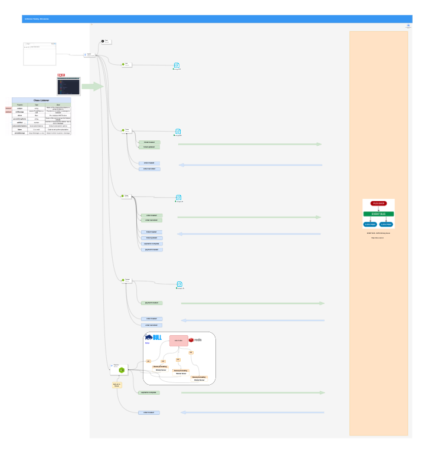

# Arquitectura



# Skaffold

```
DOCUMENTACION: https://skaffold-staging.web.app/docs/quickstart/
```

## Para iniciar un proyecto con Skaffold

skaffold init

## Para correr el proyecto y desarrollar

skaffold dev

## Para eliminar la infra del cluster

skaffold delete

# NATS Strimming Server

## 1- Mapear el puerto de monitoreo de NATS con el del local

```
sudo kubectl port-forward nats-deployment-7c8849c96f-k5lc7 8222:8222
```

## 2- Abrir esta direccion en el navegador y ver la info en JSON

```
http://localhost:8222/streaming
```

## 3- Documentacion de NATS y la libreria que usamos

[librerira => https://www.npmjs.com/package/node-nats-streaming](https://www.npmjs.com/package/node-nats-streaming)

[doc => https://docs.nats.io/](https://docs.nats.io)

## 4- Para monitorizar con graficos podemos correr el siguiente comando

1- Esto es para correrlo fuera del cluster

```
docker run -p 8282:8282 \
  -e STAN_URL=http://localhost:4222 \
  -e STAN_MONITOR_URL=http://localhost:8222 \
  -e STAN_CLUSTER=test-cluster \
  piotrpersona/nats-streaming-ui:latest
```

2- Para correrlo dentro del culster debes agregarlo a la infra y luego mapear los puertos con este comando:

```
sudo kubectl port-forward <nombre_pod_nats_ui> 8282:8282
```

Doc => <https://github.com/piotrpersona/nats-streaming-ui>

Luego puedes verlo en la direccion => <http://localhost:8282>
